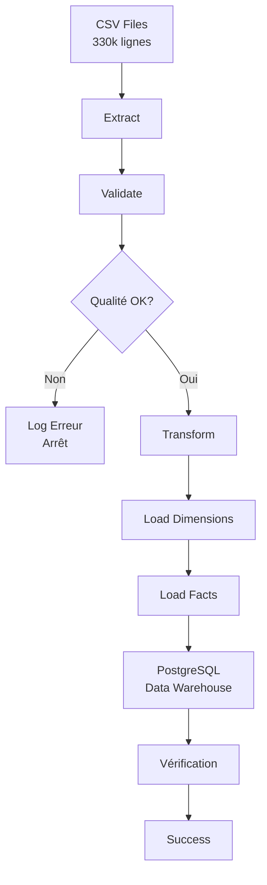
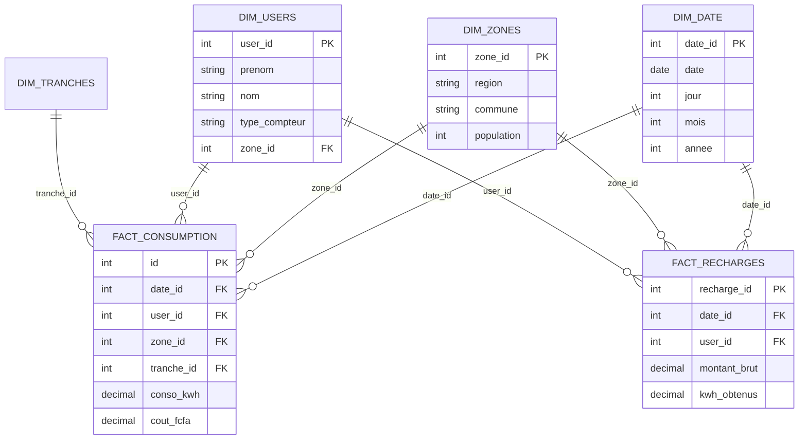
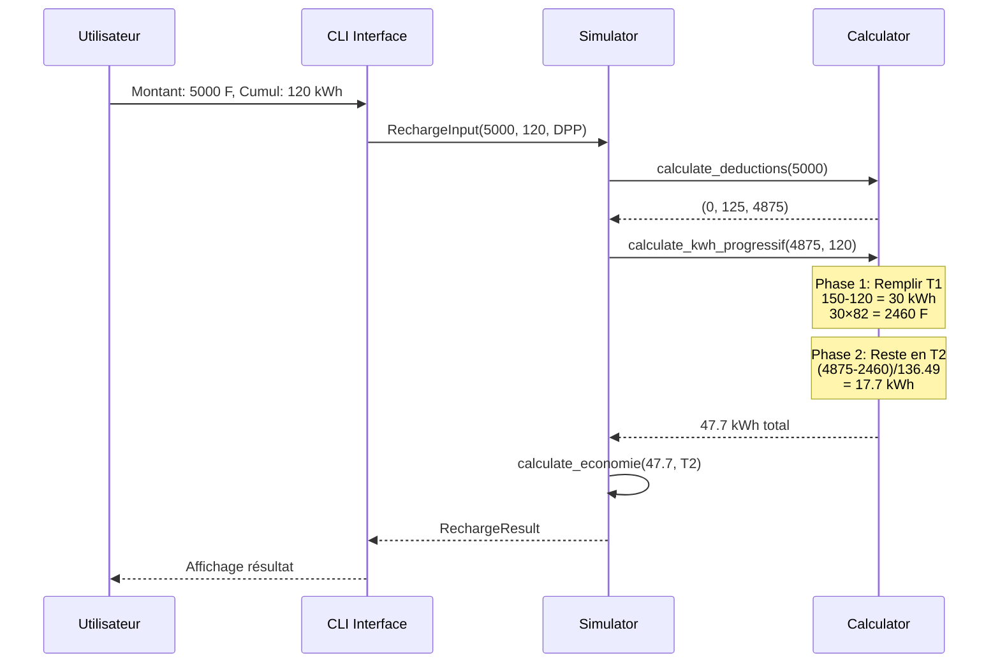
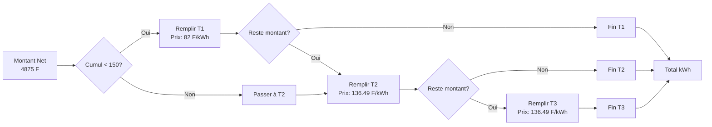
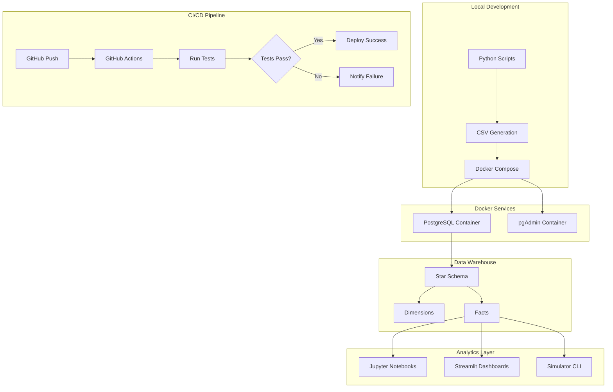

# 📊 Schémas et Diagrammes - Woyofal Data Platform

## Diagramme 1 : Flux ETL

## Diagramme 2 : Star Schema

## Diagramme 3 : Séquence Simulation

## Diagramme 4 : Calcul Progressif

## Diagramme 5 : Architecture Déploiement

---

Ces diagrammes sont prêts à être rendus par GitHub/GitLab ou par un viewer Mermaid compatible.
